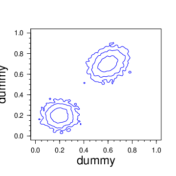
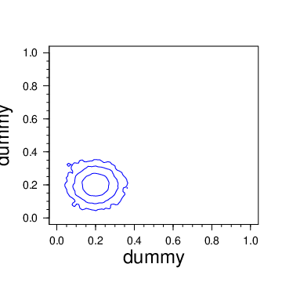

Examples to test and run tempered PMC.

1. `1_mvnorm_2D_temp_none`

   No tempering. Test of Bayesian evidence and approximations.

   Run

   ``` $COSMOPMC/bin/cosmo_pmc.pl -P $COSMOPMC -f "0.5 0.5"```

   The likelihood is a 2D multi-variate normal. The prior volume is
   the unit square. Since the likelihood is normalised, the Bayesian evidence
   is the inverse prior volume, which is 1, computed and written to the
   file `evidence_analytic`..

   The file `evidence` should be consistent with 1.

   The Laplace approximation with the Fisher matrix replacing the input likelihood
   uses as maximum-likelihood a point very close to the
   true value (given as starting point for the maximum-search by `-f "0.5 0.5")`.
   The file `evidence_fisher` should thus also be consistent with 1.

   Another Laplace approximation is computed using a the sample covariance
   instead of the true input covariance matrix. The results are performed for each
   iteration, and written to `iter_?/evidence_covariance`. For the final iteration
   the result should be close to 1.

2. `2_mixmvnorm_2D_temp_none`

   No tempering. Illustration of biased evidence if only one of multi-component
   posterior is found and sampled.

   Run

   ``` $COSMOPMC/bin/cosmo_pmc.pl -P $COSMOPMC -A y```

   The likelihood is a 2D mixture of multi-variate normals, with two non-overlapping components.
   The two components are far enough away that traditional PMC (or MCMC) does not always find
   both components.

   As in example 1, the likelihood and prior volume are normalised to one, and thus the
   Bayesian evidence is unity, see `evidence_analytic`.

   The Fisher matrix is necessarily computed at (or close) to one of the two component maxima.
   Thus, the corresponding approximate likelihood contains only half of the density, and the
   evidence is biased low by a factor of around 2.

   The evidence from PMC sampling, `evidence`, is likely to approach either 0.5 or 1, dependent
   whether one or two components have been found. Which is the case can be seen in the posterior
   contour plots, `iter_9/all_cont2d.pdf`. To test, run the code several times.

   Here is the output of two runs:

   
   Both peaks are found, evidence = 0.998802.

   
   Only one peak is found, evidence = 0.50055.
