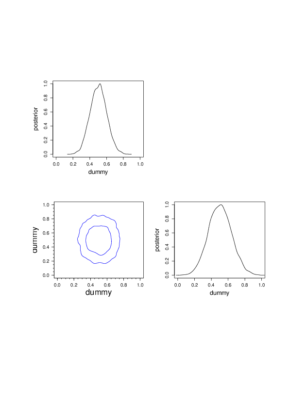
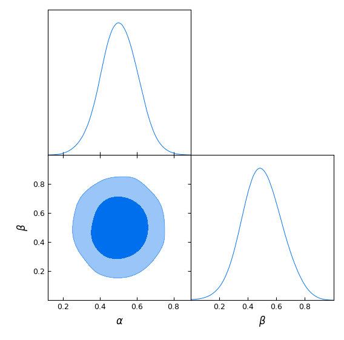
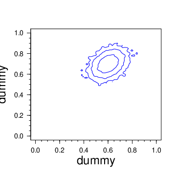

Examples to test and run tempered PMC.

If the `cosmopmc` conda enviroment is not running, activate it now:

```bash
conda activate cosmopmc
```


1. `1_mvnorm_2D_temp_none`

   No tempering. Test of Bayesian evidence and approximations.

   Run

   ```cosmo_pmc.pl -f "0.5 0.5"```

   The likelihood is a 2D multi-variate normal. The prior volume is
   the unit square. Since the likelihood is normalised, the Bayesian evidence
   is the inverse prior volume, which is 1, computed and written to the
   file `evidence_analytic`..

   The file `evidence` should be consistent with 1.

   The Laplace approximation with the Fisher matrix replacing the input likelihood
   uses as maximum-likelihood a point very close to the
   true value (given as starting point for the maximum-search by `-f "0.5 0.5")`.
   The file `evidence_fisher` should thus also be consistent with 1.

   Another Laplace approximation is computed using a the sample covariance
   instead of the true input covariance matrix. The results are performed for each
   iteration, and written to `iter_?/evidence_covariance`. For the final iteration
   the result should be close to 1.

   The final triangle contour plot is `iter_4/all_contour2D.pdf`, which is produced automatically
   if `R` is installed and working. The contours are not smoothed, and can look quite noisy. To make a nicer
   plot with smoothed 68% and 95% contours, similar to GetDist  change to `iter_4` and run the command

   ``` Rscript `which plot_confidence.R ` pmcsim -c ../config_pmc -g 10 -s 2```

   The output should look like this:

   <table>
   <tr>
   <td>
   
   </td>
   </tr>
   </table>

   For comparison, this is the output of `cobaya/GetDist` of the same posterior (see the cobaya
   config file `1_mvnorm_2D_temp_none/gaussian.yaml`) with MCMC:

   <table>
   <tr>
   <td>
   
   </td>
   </tr>
   </table>


2. `2_mixmvnorm_2D_temp_none`

   No tempering. Illustration of biased evidence if only one of multi-component
   posterior is found and sampled.

   Run

   ``` cosmo_pmc.pl -A y```

   The likelihood is a 2D mixture of multi-variate normals, with two non-overlapping components.
   The two components are far enough away that traditional PMC (or MCMC) does not always find
   both components.

   As in example 1, the likelihood and prior volume are normalised to one, and thus the
   Bayesian evidence is unity, see `evidence_analytic`.

   The Fisher matrix is necessarily computed at (or close) to one of the two component maxima.
   Thus, the corresponding approximate likelihood contains only half of the density, and the
   evidence is biased low by a factor of around 2.

   The evidence from PMC sampling, `evidence`, is likely to approach either 0.5 or 1, dependent
   whether one or two components have been found. Which is the case can be seen in the posterior
   contour plots, `iter_9/all_cont2d.pdf`. To test, run the code several times.

   Here is the output of three runs:

   <table>

   <tr>
   <td>
   
   </td>
   <td>
   
   </td>
   <td>
   
   </td>
   </tr>
   <tr>
   <td>Both peaks are found, evidence = 0.998802.</td>
   <td>Only the first peak is found, evidence = 0.50055.</td>
   <td>Only the second peak is found, evidence = 0.499927.</td>
   </tr>

   </table>

3. `3_topolike_1D_temp_log`

   For this example, the topology likelihood needs to be installed and linked with `CosmoPMC`.
   Run

   ``` cosmo_pmc.pl```

   In this 1D example, only one of the three angles is varied. The multi-modal posterior should
   be visible.
