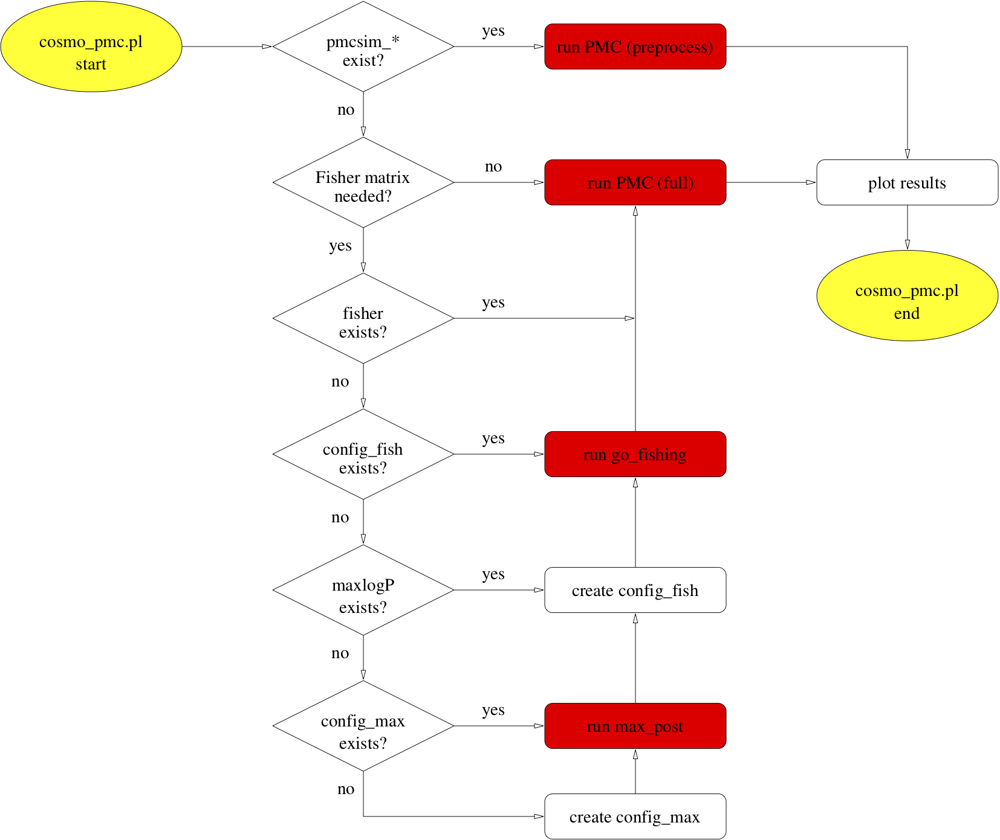

# CosmoPMC
Cosmology sampling with Population Monte Carlo (PMC)

## Information

### Description

CosmoPMC is a Monte-Carlo sampling method to explore the likelihood of various
cosmological probes. The sampling engine is implemented with the package
pmclib. It is called Population MonteCarlo (PMC), which is a novel technique to
sample from the posterior (Cappé et al. 2008). PMC is an adaptive importance
sampling method which iteratively improves the proposal to approximate the
posterior. This code has been introduced, tested and applied to various
cosmology data sets in Wraith, Kilbinger, Benabed et al. (2009). Results on the
Bayesian evidence using PMC are discussed in Kilbinger, Wraith, Benabed et al.
(2010). 


### Authors

Martin Kilbinger

Karim Benabed, Olivier Cappé, Jean Coupon, Jean-François Cardoso, Gersende Fort, Henry Joy McCracken, Simon Prunet, Christian P. Robert, Darren Wraith 

### Version

1.3

### Installation

`CosmoPMC` requires the libraries `nicaea` and `pmclib`. First, download and install those packages, from their respective github pages for [nicaea](https://github.com/CosmoStat/nicaea) and [pmclib](https://github.com/martinkilbinger/pmclib).

Next, download the `CosmoPMC` package from the github repository:

```bash
git clone https://github.com/martinkilbinger/CosmoPMC
```

A new directory `CosmoPMC` will be created automatically. Change into that directory, and configure the code with the (poor-man's) python configuration script.

```bash
cd CosmoPMC
./configure.py
```

You will need to indicate paths to libraries and other flags. Type `./configure.py -h` to see all options.

After configuration, compile the code as follows:

```bash
make
```

### Running the code - quick guide

#### <a href="Examples"></a>Examples

To get familiar with `CosmoPMC`, use the examples which are included
in the software package. Simply change to one of the subdirectories in
`COSMOPMCDIR/Demo/MC_Demo` and proceed on to the subsection
[Run](#Run) below.

#### User-defined runs

To run different likelihood combinations, using existing or your own data, the following two
steps are recommended to set up a CosmoPMC run.

1. Data and parameter files

Create a new directory and copy data files. You can do this automatically for the pre-defined
probes of `CosmoPMC` by using

```bash
newdir_pmc.sh
```

When asked, enter the likelihood/data type. More than one type can be chosen by
adding the corresponding (bit-coded) type id’s. Symbolic links to corresponding
files in `COSMOPMC/data` are set, and parameter files from `COSMOPMC/par_files`
are copied to the new directory on request.

2. Configuration file

Create the PMC configuration file `config_pmc`. Examples for existing data mod-
ules can be found in `COSMOPMC/Demo/MC_Demo`. In some cases, information about
the galaxy redshift distribution(s) have to be provided, and the corresponding
files (`nofz*`) copied. See [Examples](#Examples) above.


#### <a name="Run"></a>Run

Type

```bash
/path/to/CosmoPMC/bin/cosmo pmc.pl -n NCPU
```

to run CosmoPMC on NCPU CPUs. See `cosmo pmc.pl -h` for more options. Depending
on the type of initial proposal, a maximum-search is started followed by a
Fisher matrix calculation. After that, PMC is started. The figure below shows a flow
chart of the script’s actions.


#### Diagnostics

Check the text files `perplexity` and `enc`. If the perplexity reaches values of 0.8 or
larger, and if the effective number of components (ENC) is not smaller than around
1.5, the posterior has very likely been explored sufficiently. Those and other
files are being updated during run-time and can be monitored while PMC is running.

#### Results

The results are stored in the subdirectory of the last, final PMC iteration,
`iter_{niter-1}/`. The text file `mean` contains mean and confidence levels. The file
`all_cont2d.pdf` (or `all_contour2d.pdf` shows plots of the 1d- and 2d-marginals. Plots can be
redone or refined, or created from other than the last iteration with
`plot_confidence.R` (or `plot_contour2d.pl`), both scripts are in `/path/to/CosmoPMC/bin`.
Note that in the default setting the posterior plots are not
smoothed.


<p align="center">
  
</p>

### References

If you use CosmoPMC in a publication, please cite the last paper in the list below (Wraith, Kilbinger, Benabed et al. 2009).

[Kilbinger et al. (2011)](https://arxiv.org/abs/1101.0950): Cosmo Population Monte Carlo - User's manual. Note that earlier version of CosmoPMC <=1.2) contain `pmclib` and `nicaea` as built-in code instead of external libraries.

[Kilbinger, Benabed et al. (2012)](http://ascl.net/1212.006): ASCL link of the software package

[Kilbinger, Wraith, Benabed et al. (2010)](https://arxiv.org/abs/0912.1614): Bayesian evidence

[Wraith, Kilbinger, Benabed et al. (2009)](https://arxiv.org/abs/0903.0837): Comparison of PMC and MCMC, parameter estimation. The first paper to use CosmoPMC.

